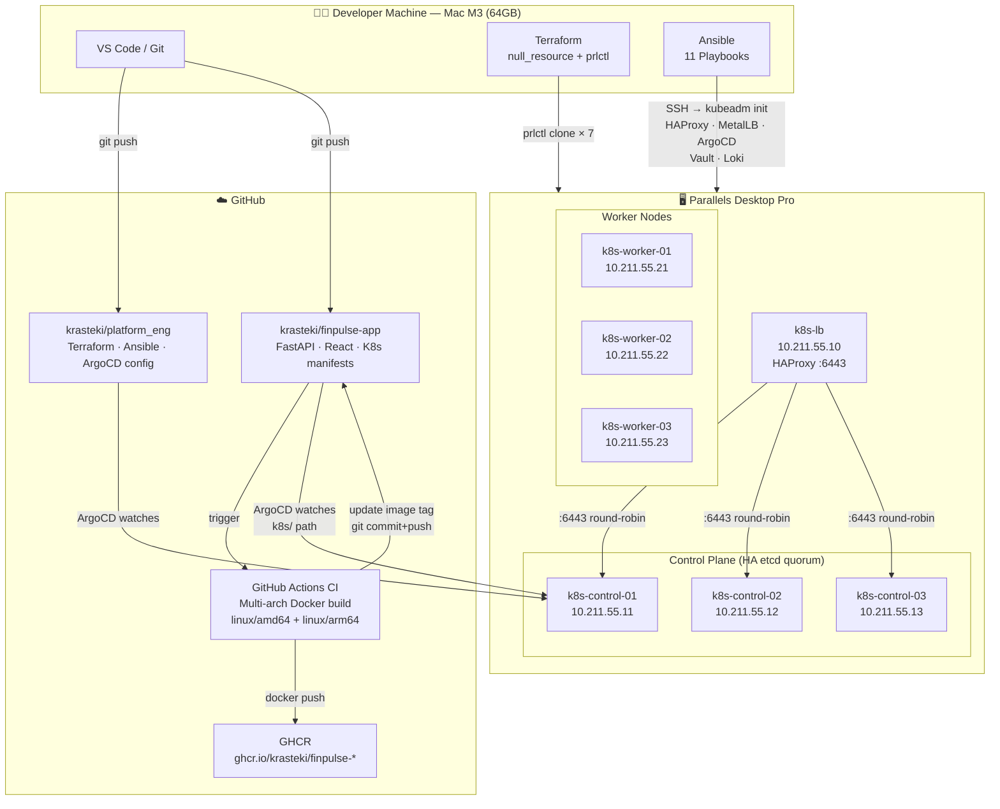
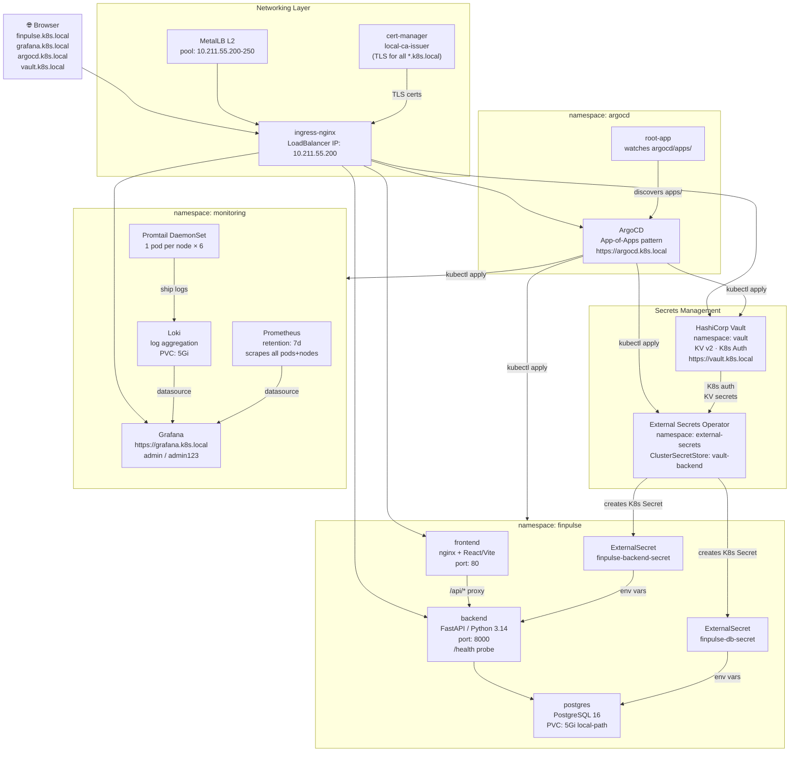
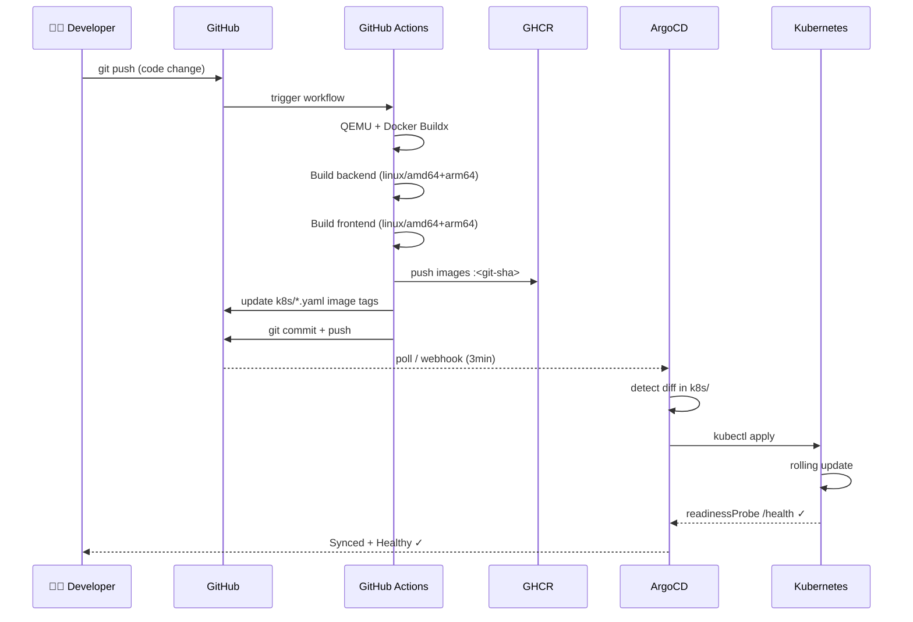
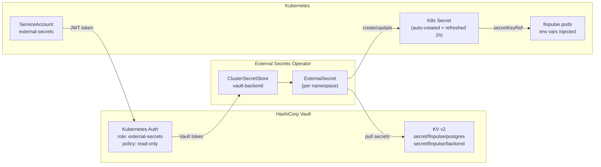

# FinPulse — Platform Engineering Architecture

> **Local Kubernetes Platform** built with GitOps, CI/CD, Secrets Management, and full Observability  
> **Stack:** Parallels · Terraform · Ansible · Kubernetes (HA) · ArgoCD · GitHub Actions · Vault · Prometheus · Grafana · Loki

---

## High-Level Architecture



---

## Kubernetes Cluster — Internal Architecture



---

## CI/CD GitOps Flow



---

## Secrets Flow (Vault + ESO)



---

## Infrastructure Stack — Component Summary

| Layer | Component | Version | Role |
|---|---|---|---|
| **Virtualization** | Parallels Desktop Pro | ARM64 | 7 VMs on Mac M3 |
| **IaC** | Terraform + null_resource | ≥1.5 | VM provisioning via prlctl |
| **Config Mgmt** | Ansible | 11 playbooks | K8s setup + platform config |
| **Container Runtime** | containerd | 1.7 | CRI on all nodes |
| **Kubernetes** | kubeadm | v1.29 | HA cluster (3 control + 3 workers) |
| **Load Balancer** | HAProxy | — | API server HA endpoint :6443 |
| **CNI** | Flannel | — | Pod network 10.244.0.0/16 |
| **LB for Services** | MetalLB | v0.14 | L2 mode, IP pool .200-.250 |
| **Ingress** | ingress-nginx | — | Single entry point, TLS termination |
| **TLS** | cert-manager | v1.14 | local-ca-issuer for *.k8s.local |
| **GitOps** | ArgoCD | v2.x | App-of-Apps, automated sync |
| **CI/CD** | GitHub Actions | — | Multi-arch Docker build + push |
| **Registry** | GHCR | — | ghcr.io/krasteki/finpulse-* |
| **Secrets** | HashiCorp Vault | 0.28 | KV v2, Kubernetes auth method |
| **Secrets Sync** | External Secrets Operator | 0.9 | Vault → K8s Secrets (1h refresh) |
| **Storage** | local-path-provisioner | v0.0.28 | Default StorageClass (PVCs) |
| **Metrics** | Prometheus | — | 7d retention, K8s + app metrics |
| **Dashboards** | Grafana | — | Metrics + Logs in one UI |
| **Logs** | Loki + Promtail | 2.6 | Log aggregation, 7d retention |
| **App — Backend** | FastAPI + Python 3.14 | — | REST API, yfinance, asyncpg |
| **App — Frontend** | React + Vite + TypeScript | — | SPA served by nginx |
| **App — Database** | PostgreSQL | 16 | Persistent storage |

---

## Key Design Decisions

| Decision | Rationale |
|---|---|
| **HA Control Plane (3 nodes)** | etcd quorum, no single point of failure |
| **HAProxy before API server** | Single `k8s-lb:6443` endpoint, hides control plane topology |
| **Two-repo strategy** | `platform_eng` (infra) vs `finpulse-app` (app) — separate concerns, separate access rights |
| **App-of-Apps (ArgoCD)** | Scalable GitOps: new app = one yaml file in `argocd/apps/` |
| **Multi-arch Docker build** | Parallels VMs are ARM64, GitHub runners are AMD64 — both needed |
| **Image tag = git SHA** | Full traceability: know exactly which commit is deployed |
| **Vault + ESO over plain K8s Secrets** | Secrets never in Git, centralized rotation, audit log |
| **Loki over ELK** | 10× lower resource usage, integrates natively into Grafana |
| **MetalLB L2** | Real LoadBalancer IPs on bare-metal without cloud provider |
| **cert-manager + local CA** | HTTPS everywhere, realistic prod-like setup locally |
| **local-path-provisioner** | PVCs work on bare-metal without NFS or cloud storage |
| **Terraform null_resource** | No Parallels provider available; prlctl CLI is idempotent and works immediately |

---

## Endpoints

| URL | Service | Credentials |
|---|---|---|
| https://finpulse.k8s.local | FinPulse Application | — |
| https://argocd.k8s.local | ArgoCD UI | admin / *(see initial secret)* |
| https://grafana.k8s.local | Grafana (Metrics + Logs) | admin / admin123 |
| https://vault.k8s.local | HashiCorp Vault UI | Token: see `vault-init-keys` secret |
| https://dashboard.k8s.local | Kubernetes Dashboard | Bearer token |

---

## Ansible Bootstrap Order

Full cluster bootstrap from zero — run in sequence:

```bash
cd ansible/
ansible-playbook -i inventory.ini 01-prereqs.yml        # OS prep: swap off, modules, sysctl, containerd, kubeadm/kubelet
ansible-playbook -i inventory.ini 02-haproxy.yml        # HAProxy LB on k8s-lb → API server :6443
ansible-playbook -i inventory.ini 03-control-init.yml   # kubeadm init on control-01, copy kubeconfig, install Flannel CNI
ansible-playbook -i inventory.ini 04-join-nodes.yml     # Join control-02/03 + workers to cluster
ansible-playbook -i inventory.ini 05-static-ips.yml     # Persist static IPs across VM reboots (netplan)
ansible-playbook -i inventory.ini 06-metallb.yml        # MetalLB L2 + IP pool 10.211.55.200-250
ansible-playbook -i inventory.ini 07-ingress-nginx.yml  # ingress-nginx (LoadBalancer → MetalLB IP)
ansible-playbook -i inventory.ini 08-cert-manager.yml   # cert-manager + local CA + ClusterIssuer
ansible-playbook -i inventory.ini 09-argocd.yml         # ArgoCD + root App-of-Apps → deploys everything else
ansible-playbook -i inventory.ini 10-prometheus-stack.yml # kube-prometheus-stack (Prometheus + Grafana + Alertmanager)
ansible-playbook -i inventory.ini 11-vault-init.yml     # Vault init + unseal + KV v2 + K8s auth + finpulse secrets
```

> After playbook 09, ArgoCD automatically deploys: MetalLB config, ingress-nginx, cert-manager, Vault, ESO, Loki, finpulse app.  
> Playbook 11 must run **after** ArgoCD has synced the Vault application (pod Running).

---

## Repositories

| Repo | Purpose |
|---|---|
| `github.com/krasteki/platform_eng` | Terraform · Ansible · ArgoCD config · Architecture docs |
| `github.com/krasteki/finpulse-app` | Application code · K8s manifests · CI pipeline |
| `ghcr.io/krasteki/finpulse-backend` | Backend Docker image (multi-arch) |
| `ghcr.io/krasteki/finpulse-frontend` | Frontend Docker image (multi-arch) |
